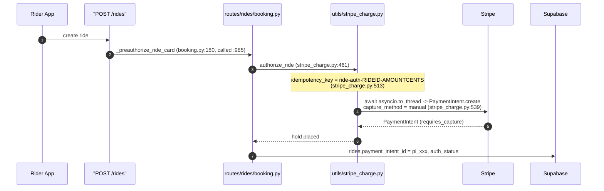
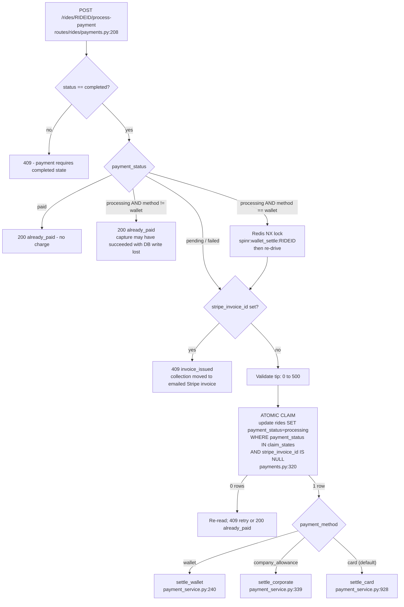
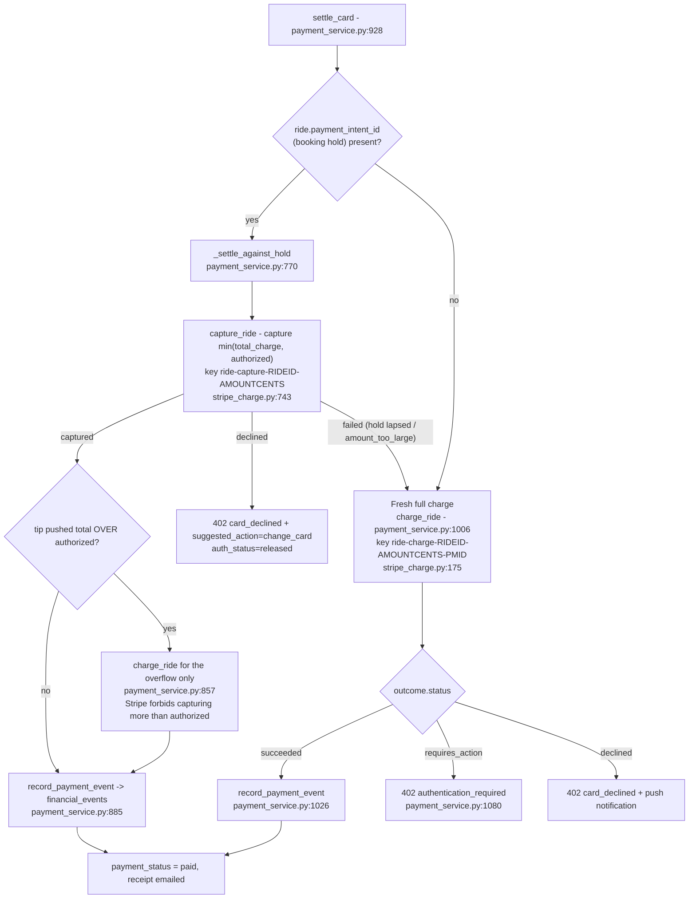
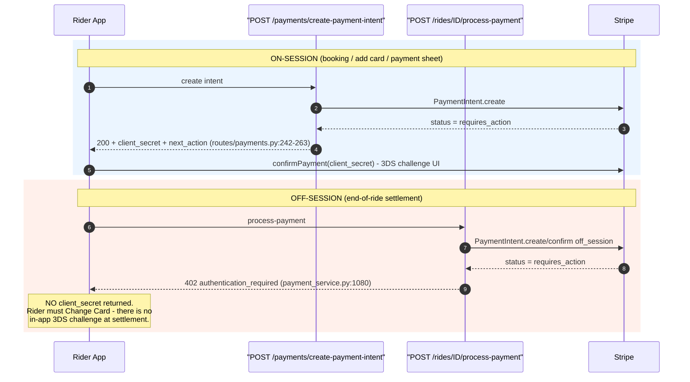
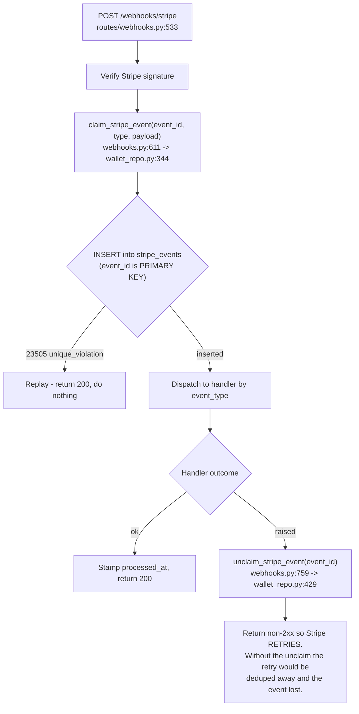

# Rider Payment Architecture — Stripe (as extracted from code)

Read-only recon, 2026-08-06. Extracted by static reading + grep from
`backend/routes/rides/payments.py`, `backend/routes/rides/booking.py`,
`backend/routes/payments.py`, `backend/routes/webhooks.py`,
`backend/services/payment_service.py`, `backend/utils/stripe_charge.py`,
`backend/utils/payment_retry.py`, `backend/utils/stripe_reconcile.py`,
`backend/core/lifespan.py`, `backend/repositories/wallet_repo.py`,
`backend/migrations/`, and `rider-app/utils/attemptRidePayment.ts`.

This documents what the code **actually does**, not the intended design. Where the
two diverge it is called out under [Known gaps](#known-gaps).

Scope: the **rider** payment path. Driver payouts, corporate wallet top-up, and
subscription billing are referenced only where they share a table or code path.

---

## Summary

| Question | Answer |
|---|---|
| Is there a ledger? | **Yes** — `financial_events`, append-only, signed `delta_cents`. Single-entry, **not** double-entry. |
| Are there idempotency keys? | **Yes**, at three independent layers: Stripe SDK `idempotency_key`, webhook event claim, and a DB `payment_status` optimistic lock. |
| Is it async? | **Yes** — every blocking Stripe SDK call is wrapped in `asyncio.to_thread()`, plus three background reconcile/retry loops. The settlement charge itself is still awaited **inline** in the request handler, not queued. |

---

## 1. Booking — the pre-authorization hold

At booking time Spinr places a **manual-capture** PaymentIntent (a hold) on the
rider's card. Money is not captured until the ride completes.



If the ride is cancelled before completion, the hold is released via
`cancel_authorization()` (`stripe_charge.py:782`, key
`ride-cancelauth-{ride_id}-{payment_intent_id}`), called from
`routes/drivers/ride_cancel.py:142` and `utils/card_hold_release.py:93`.
Orphaned holds are swept by `backend/scripts/reconcile_orphaned_holds.py`.

---

## 2. Settlement — ride completed

`POST /rides/{ride_id}/process-payment` (`routes/rides/payments.py:208`) is the
single settlement entry point. It is guarded, claimed, then dispatched by
`payment_method`.



The claim at `payments.py:320` is the **DB-level idempotency guard**: a conditional
update on `payment_status IN ('pending','failed')` returning zero rows means another
request already owns the settlement.

### 2a. Card settlement — capture the hold, or charge fresh



Note the ordering at `payment_service.py:138`: `record_payment_event` is called
**before** the ride DB update, deliberately, so a recovery record exists in the
ledger even if the ride row is left stuck at `processing`.

---

## 3. Payment source selection

The branch is driven by `rides.payment_method` (`routes/rides/payments.py:388-407`).
The documented corporate priority chain — rider wallet → corporate allowance →
master wallet → rider card (`.claude/context/domain-payments.md:66`) — is resolved
**upstream at booking**, not re-evaluated at settlement.

| `payment_method` | Handler | Money movement | Ledger row |
|---|---|---|---|
| `wallet` | `settle_wallet` (`payment_service.py:240`) | `wallet_pay_for_ride` RPC — debit + mark-paid in one transaction (migrations `50`, `107`, `110`) | `wallet_transactions` |
| `company_allowance` | `settle_corporate` (`payment_service.py:339`) | `corporate_wallet_apply_delta` (`SECURITY DEFINER`, row lock) | corporate wallet txn |
| `card` (default) | `settle_card` (`payment_service.py:928`) | Stripe capture or fresh charge | `financial_events` |

The wallet path is atomic in a single RPC, which is why a wallet ride stuck at
`processing` is provably **never debited** and is safe to re-drive — whereas a card
ride at `processing` may have been captured with the DB write lost, so it reports
`already_paid` instead (`routes/rides/payments.py:245-256`).

---

## 4. 3DS / SCA

Two different behaviours depending on whether the rider is **on-session** (present,
able to complete a challenge) or **off-session** (settlement after the ride).



`POST /payments/payment-sheet` (`routes/payments.py:963`) returns a `client_secret`
for Stripe's native PaymentSheet (Apple Pay / Google Pay / saved cards); the client
hook is `rider-app/hooks/useSpinrPaymentSheet.ts`.

---

## 5. Webhooks



`unclaim_stripe_event` is the subtle and important half: the claim row must be
released on failure, or Stripe's redelivery hits the dedup and the event is
silently dropped.

### Handled event types

Twenty types are dispatched in `routes/webhooks.py`:

`payment_intent.succeeded` · `payment_intent.payment_failed` · `charge.succeeded` ·
`charge.captured` · `charge.updated` · `charge.pending` · `charge.refunded` ·
`charge.dispute.created` · `charge.dispute.closed` · `invoice.created` ·
`invoice.finalized` · `invoice.paid` · `invoice.updated` ·
`invoice.payment_succeeded` · `invoice.payment_failed` ·
`customer.subscription.updated` · `customer.subscription.deleted` ·
`checkout.session.completed` · `account.updated` · `payout.paid`

Refunds arriving on `charge.refunded` write a **negative** `delta_cents` row via
`record_refund_event` (`payment_service.py:179`), including the proportional
`tax_reversed` so GST/PST remittance nets out. Per policy the driver keeps their
pay on a refund; the metadata records `driver_earnings_retained` rather than
clawing it back.

---

## 6. Async model

**The Stripe Python SDK is synchronous.** Every call is therefore wrapped:

```python
intent = await asyncio.to_thread(
    lambda: stripe.PaymentIntent.create(..., idempotency_key=idempotency_key)
)
```

Call sites: `stripe_charge.py:218, 226, 388, 539, 628, 736, 802`.

This keeps the event loop free, but the charge is still **awaited inline** in the
HTTP handler — it is not queued to a worker. Settlement latency is therefore
Stripe's round-trip latency (SLA target: fare settlement P95 < 1 s).

### Background loops

Spawned in `backend/core/lifespan.py`. All run on **every replica**, so each needs
its own replay-safety mechanism.

| Loop | Cadence | File | Replay safety |
|---|---|---|---|
| `payment_retry_loop` | 300 s + jitter ±10% | `utils/payment_retry.py:617` | Redis lock, TTL = interval × 1.5 (`:630`) |
| `stripe_reconcile_loop` | Daily 02:00 UTC (`_RUN_HOUR_UTC = 2`, `:100`) | `utils/stripe_reconcile.py:726` | Redis `SET NX` leader lock, 23 h TTL (`:99`, `:741`) |
| `reconciliation_loop` | Daily 02:00 UTC | `utils/reconciliation.py` | Leader lock; also checks leg balance + leg completeness (both never-raise) |
| `ledger_projection_loop` | 900 s + jitter ±10% | `utils/ledger_projection.py` | UNIQUE(event_id, account, side) + whole-batch insert (23505 = written); Redis lock is a throttle only. No-op unless `ledger_double_entry_enabled`. |
| Corporate auto-top-up | periodic | `lifespan.py:283` | Idempotency key per top-up |
| Stale intent reconciler | 900 s + jitter ±60 s (`:68`, `:253`) | `utils/stale_intent_reconciler.py` | Idempotent by construction |

`stripe_reconcile` flags paid rides with no matching Stripe PaymentIntent, amount
mismatches, and orphaned Stripe charges — writing to `reconciliation_discrepancies`
(migration `59`).

---

## 7. Ledger

### `financial_events` — migration `58_financial_events.sql`

Append-only. Signed amounts; **positive = money in, negative = money out**.

| Column | Type | Notes |
|---|---|---|
| `id` | `uuid` PK | |
| `event_type` | `text` | CHECK over 9 values: `stripe_charge`, `stripe_refund`, `stripe_dispute`, `wallet_topup`, `wallet_debit`, `fare_settle`, `fare_split_debit`, `driver_payout`, `tax_adjust` |
| `user_id` | `text` | FK → `users(id)` |
| `ride_id` | `text` | FK → `rides(id)`, nullable |
| `delta_cents` | `bigint` | Signed. Integer cents — never float. |
| `ref` | `text` | External reference — Stripe PaymentIntent ID, payout transfer ID |
| `metadata` | `jsonb` | Fare/tip/tax breakdown, `driver_id`, surge, area-level pickup/dropoff |

Retention: **7 years** (CRA + Saskatchewan Transportation Act). This outlives the
PIPEDA account-deletion scrub, which is why `record_payment_event` stores only
`area_only(...)` city-level locations, never the exact address
(`payment_service.py:151-157`).

### Other money tables

| Table | Migration | Shape |
|---|---|---|
| `wallet_transactions` | `19_wallet.sql` | Append-only; `type` CHECK over 9 values, `amount`, running `balance_after NUMERIC(12,2)`, `reference_id` |
| `financial_event_entries` | `286_financial_event_entries.sql` | Double-entry legs for `financial_events`. `amount_cents` always positive; direction in `side` (debit/credit). **Single writer: the `ledger_projection` loop** derives legs from headers ≥30 min old via the migration-287 anti-join RPC (backfills all history). Flag-gated, default off. |
| `subscription_payments` | `151_subscription_payments_ledger.sql` | Subscription billing ledger |
| `reconciliation_discrepancies` | `59_...sql` | Output of the daily reconcile |
| `stripe_events` | `22_stripe_events.sql` | Webhook dedup — not a money ledger |

---

## 8. Idempotency — all three layers

### Layer 1 — Stripe SDK

Every mutating Stripe call in `utils/stripe_charge.py` passes an `idempotency_key`:

| Operation | Key shape | Line |
|---|---|---|
| Booking hold | `ride-auth-{ride_id}-{amount_cents}` | `:513` |
| Fresh charge | `ride-charge-{ride_id}-{amount_cents}-{payment_method_id}` | `:175` |
| Confirm | `ride-confirm-{ride_id}-{amount_cents}` | `:222` |
| Capture hold | `ride-capture-{ride_id}-{amount_cents}` | `:743` |
| Release hold | `ride-cancelauth-{ride_id}-{payment_intent_id}` | `:806` |
| Ancillary fee | `{fee_type}-{ride_id}-{amount_cents}-{payment_method_id}` | `:369` |

Ancillary fees (cancellation, cleaning, wait-time) get their own key namespace
prefixed by `fee_type` so two different fee types on the same ride do not collide
(`stripe_charge.py:366`).

### Layer 2 — webhook event claim

`stripe_events.event_id` is the PRIMARY KEY; the INSERT *is* the lock. See §5.

### Layer 3 — DB optimistic lock

The conditional `payment_status` claim at `routes/rides/payments.py:320`, plus a
Redis `SET NX` gate for the wallet re-drive path (`:314`).

---

## Known gaps

Stated explicitly rather than left implied.

1. ~~**The ledger is single-entry, not double-entry.**~~ **Addressed 2026-08-06/07 (flagged
   off).** `financial_event_entries` (migration 286) holds balanced debit/credit legs as a
   child table — deliberately not as extra rows in `financial_events`, because
   `reconciliation._sum_financial_events` sums `delta_cents` and contra rows there would
   cancel the daily Stripe reconciliation to zero. As of 2026-08-07 legs are derived
   **asynchronously by the `ledger_projection` loop** (single writer; migration-287 work
   queue; backfills all history; undecomposable events booked whole to `platform_revenue`
   with `spinr_alert=ledger_legs_degraded`). Gated on `ledger_double_entry_enabled`;
   **default off, and migrations 286/287 have not been run against a live database yet** —
   until then the effective state is still single-entry. Standing limitation either way:
   `platform_revenue` is the plug, so a mis-stated `driver_earnings` books silently into it;
   Stripe reconciliation, not the trial balance, catches that class.

2. ~~**Ledger writes are best-effort and can silently under-report.**~~ **Fully addressed
   2026-08-07.** All writers now route through `ledger_service.record_event` (client-
   generated PK, 3 retries, duplicate-key = success, `spinr_alert=ledger_write_failed` on
   exhaustion, never raises): the two `payment_service.py` writers (2026-08-06), and the two
   cancellation-fee writers in `routes/rides/cancellation.py` (2026-08-07 — a recheck showed
   `routes/webhooks.py` was already routed via `record_payment_event`, so the earlier "three
   writers outstanding" was two). Additionally, behind `ledger_atomic_settle_enabled`
   (default off, migration 288), card settlement can finalize the paid-flip **and** the
   header in one Postgres transaction (`settle_ride_card_payment`), closing the remaining
   process-death window between the Stripe capture and the DB writes; absent function or
   flag falls back to the legacy two-write path.

3. **Idempotency keys embed `amount_cents`.** A different tip yields a different key
   and therefore a genuinely new charge — correct for tip changes, but it means the
   key does **not** protect against a double charge if the amount is recomputed even
   slightly differently between two attempts. The protection there comes from
   layer 3 (the `payment_status` claim), not from Stripe.

4. **The rider app has a dead 3DS branch.** `rider-app/utils/attemptRidePayment.ts`
   documents (`:124-130`) and implements (`:160-188`) a
   `200 {status:'requires_action', client_secret}` response from
   `/rides/{id}/process-payment`. The backend never returns that shape — the success
   return is only `{success, charged_amount, email_sent}`
   (`routes/rides/payments.py:463`), and the 3DS case returns **402
   `authentication_required`** (`payment_service.py:1080`). The 402 is handled
   correctly at `attemptRidePayment.ts:214`, so the rider is not stuck — but the
   in-app challenge path is unreachable, and a rider whose card requires SCA at
   settlement must change card rather than authenticate.

5. ~~**`.claude/context/domain-payments.md` never mentions `financial_events`.**~~
   **Addressed 2026-08-06** — the domain context now carries a Ledger section, the three
   idempotency layers, and a pointer here.

6. **The daily reconciliation crashed on month-end** (`datetime(y, m, day + 1)` →
   `ValueError` on the last day of every month, ~12 skipped runs/year masked as a
   transient DB error). **Fixed 2026-08-07** with `timedelta(days=1)` + a parametrized
   boundary regression test.

7. **The 7-year DSAR hard delete was structurally impossible** — migration 58's
   append-only trigger raised on the very DELETE that `purge_pii_retention` Step H runs,
   and its handler only catches FK violations, so the whole purge aborted. **Fixed
   2026-08-07** (migration 289: transaction-local `spinr.financial_events.allow_delete`
   gate, the migration-56 pattern). **Still open, dormant until ~2033:** Step B's
   `DELETE FROM rides` at 7 years will FK-violate against retained
   `financial_events.ride_id` rows (NO ACTION, no handler) and abort the purge — needs
   its own design (NULL-first vs `ON DELETE SET NULL`).

---

## Related

- `.claude/context/domain-payments.md` — fare formula, surge rules, receipt line items
- `docs/audit/trip-state-machine.md` — ride state machine (settlement requires `completed`)
- `CLAUDE.md` — Decimal-only money arithmetic, Stripe idempotency convention
