# Spinr Trip State Machine (as extracted from code)

Extracted from `backend/models/ride_status.py`, `backend/routes/rides/*.py`,
`backend/routes/drivers/*.py`, `backend/services/dispatch_service.py`,
`backend/utils/scheduled_rides.py`, `backend/utils/offer_expiry_reaper.py`,
`backend/utils/stuck_ride_sweeper.py`. All states/transitions below were
confirmed by an actual `.status = RideStatus.X` / string-literal write found
via Grep + Read in this session; see file:line references inline.

## States (from `backend/models/ride_status.py:17-25`)

```
scheduled, searching, driver_assigned, driver_accepted, driver_arrived,
in_progress, completed, cancelled
```

`active_statuses()` (line 29-38): `{searching, driver_assigned,
driver_accepted, driver_arrived, in_progress}` — matches CLAUDE.md exactly.
`terminal_statuses()` (line 40-42): `{completed, cancelled}`.

## Mermaid diagram

```mermaid
stateDiagram-v2
    [*] --> scheduled: booking with future pickup time
    [*] --> searching: booking with immediate pickup time

    scheduled --> searching: scheduled-dispatch loop\n(utils/scheduled_rides.py)
    scheduled --> cancelled: rider/admin cancel\n(routes/rides/cancellation.py)

    searching --> driver_assigned: DispatchService.assign_driver_to_ride\n(services/dispatch_service.py:442-454, STRING LITERAL not enum)
    searching --> cancelled: stuck_ride_sweeper (5min timeout, system)\n(utils/stuck_ride_sweeper.py:48-65)
    searching --> cancelled: rider cancel\n(routes/rides/cancellation.py)

    driver_assigned --> driver_accepted: driver accepts offer\n(routes/drivers/ride_flow.py:220-227, filter status=SEARCHING**)
    driver_assigned --> searching: offer expiry / driver declines\n(routes/rides/matching.py:1032, process_expired_offer)
    driver_assigned --> cancelled: rider/driver/admin cancel

    driver_accepted --> driver_arrived: driver marks arrived\n(routes/drivers/ride_flow.py:605-609)
    driver_accepted --> cancelled: rider/driver/admin cancel

    driver_arrived --> in_progress: driver OR rider starts ride\n(routes/drivers/ride_flow.py:670-673; routes/rides/lifecycle.py:90-98 — TWO independent call sites)
    driver_arrived --> cancelled: rider cancel / driver no-show\n(routes/drivers/ride_cancel.py:268-269)

    in_progress --> completed: driver OR rider completes ride\n(routes/drivers/ride_complete.py:621; routes/rides/lifecycle.py:145-161 — TWO independent call sites)

    completed --> [*]
    cancelled --> [*]
```



`**` note: `routes/drivers/ride_flow.py:220` filters the *acceptance* update
on `{"id": ride_id, "status": RideStatus.SEARCHING, "driver_id": None}` —
i.e. code-level evidence suggests a driver "accepts" directly from
`searching` in one path and the `driver_assigned` step is set moments
earlier by dispatch (`ride_flow.py:212`) as part of the same offer flow;
both `driver_assigned` (line 212) and `driver_accepted` (line 227) writes
appear in the same function, consistent with CLAUDE.md's diagram where
`driver_assigned` → `driver_accepted` is a fast, same-request transition
once a specific driver accepts an offer, rather than a separate
rider-invisible intermediate state that persists.

## Discrepancies vs CLAUDE.md's documented diagram

CLAUDE.md states:
```
scheduled -> searching -> driver_assigned -> driver_accepted -> driver_arrived -> in_progress -> completed
searching/driver_assigned can revert to searching on offer timeout
cancelled only pre-trip (before in_progress)
```

What was actually found in code:

1. **Confirmed**: the forward chain and the `driver_assigned → searching`
   revert-on-timeout path (`routes/rides/matching.py` `process_expired_offer`,
   invoked both in-line and durably via `utils/offer_expiry_reaper.py`).
2. **Confirmed**: `cancelled` transitions are only ever written from
   pre-`in_progress` states in every call site found this pass — no
   contradicting evidence of a `in_progress → cancelled` write was found.
3. **Partial gap in CLAUDE.md's diagram**: `scheduled → cancelled` directly
   (without transiting `searching`) is a real path
   (`routes/rides/cancellation.py:491` writes back to `RideStatus.SCHEDULED`,
   implying scheduled-ride cancel/reschedule handling; CLAUDE.md's diagram
   only shows `scheduled → cancelled (auto, no drivers found after ~5min)`,
   which is actually the *searching* timeout, not a scheduled-specific one —
   worth a follow-up read of `cancellation.py:470-495` to pin down exactly
   what `SCHEDULED` write is for, since it looked more like a
   cancel-then-requeue than a terminal cancel).
4. **Not verified this pass**: whether `driver_assigned → cancelled` and
   `driver_accepted → cancelled` are actually reachable from the rider side
   specifically (vs only from driver/admin) — `cancellation.py`'s
   `_cancellable_states` tuple (referenced at `cancellation.py:80`) was not
   read in full this session; a follow-up should confirm its exact contents
   match CLAUDE.md's claimed pre-`in_progress` invariant precisely.

## Duplicate-logic call-outs (highest-value finding, cross-referenced from findings.md #1)

The state machine's guard logic is implemented in **four independent
places** rather than one:

| Guard style | Location | Exception raised |
|---|---|---|
| Structured allowed-set lookup (rider) | `routes/rides/_shared.py:290` `_require_ride_in_state_rider` | `SpinrException` (409) / `RideNotFoundException` (404) |
| Structured allowed-set lookup (driver) | `routes/drivers/_shared.py:558` `_require_ride_in_state` | plain `HTTPException` (409/404) |
| Inline check + atomic update_one guard | `routes/rides/lifecycle.py:82-100, 145-161` (`rider_start_ride`, `rider_complete_ride`) | `HTTPException(400)` then `HTTPException(409)` on race |
| Raw Supabase claim query | `utils/stuck_ride_sweeper.py:57-65` | N/A (background loop, no HTTP response) |

Additionally, `routes/drivers/ride_complete.py:621` builds an inline filter
dict (`{"id": ride_id, "driver_id": driver["id"], "status":
RideStatus.IN_PROGRESS}`) as a fifth ad hoc instance of the same "atomic
compare-and-swap on status" idiom, without going through either
`_require_ride_in_state` helper.

**Why this matters for the state machine specifically**: the actual set of
"allowed prior states" for a given transition (e.g., what states can
legally precede `in_progress → completed`) is defined independently in each
of these call sites. There is no single place a reviewer can read to get
the authoritative list of valid transitions — it must be reconstructed (as
this document does) by grepping every status-touching file. A change to the
state machine (e.g., adding a new pre-trip cancellation path) risks being
applied to only one of the four/five implementations.

## Insurance-period cross-mapping (for context, from `backend/utils/insurance_periods.py`)

Confirmed via `routes/rides/lifecycle.py:105` (period 3 recorded on
`rider_start_ride`'s successful `in_progress` transition) and `:168` (period
1 recorded on `rider_complete_ride`'s successful `completed` transition):

| Ride state | Insurance period | Where recorded |
|---|---|---|
| `driver_assigned` / `driver_accepted` / `driver_arrived` | 2 | not directly observed this pass in `lifecycle.py` (CLAUDE.md says period 2 starts on `driver_assigned`) — recommend a follow-up read of `routes/drivers/ride_flow.py` around the `driver_assigned`/`driver_accepted` writes (lines 212-227) to confirm the period-2 `record_period_transition` call site |
| `in_progress` | 3 | `routes/rides/lifecycle.py:105` `await _deps.record_period_transition(driver_row["id"], 3, ride_id=ride_id)` |
| back to available (post-`completed`) | 1 | `routes/rides/lifecycle.py:168` `await _deps.record_period_transition(driver_id, 1)` |

This confirms the ride-lifecycle code does call into the insurance-period
audit trail at the two transition points read in this session, consistent
with CLAUDE.md's regulatory requirement; the period-2 call site (assigned →
accepted → arrived) was not directly located in this pass and should be a
follow-up check.
