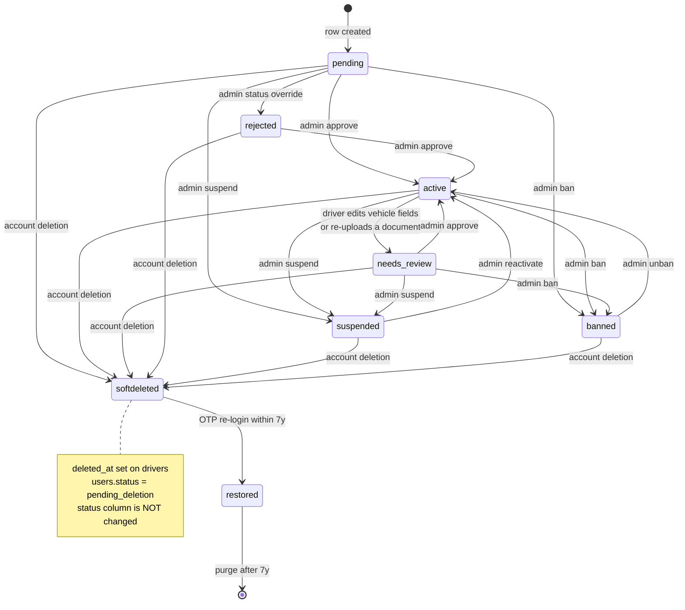

# Driver Lifecycle & Status Flow

Source of truth for what `drivers.status` means at every phase, who moves it,
and what each value gates. Derived from the code, not from intent — file/line
references are given so this can be re-verified when the code changes.

Column contract: `drivers.status TEXT NOT NULL DEFAULT 'pending'`
(`backend/migrations/12_driver_lifecycle_status.sql`).

---

## 1. The six statuses

| Status | Meaning | Can go online? | Set by |
|---|---|---|---|
| `pending` | Row exists, application incomplete or awaiting first admin decision | No | Row creation (default) |
| `active` | Approved. The only status that can accept rides | **Yes** | Admin `approve` / `unban` / `reactivate` |
| `needs_review` | Was approved, then changed vehicle info or re-uploaded a document. Forced offline until an admin re-approves | No | System (driver-triggered) |
| `rejected` | Application declined | No | Admin status override |
| `suspended` | Temporary admin block, reason required, reversible | No | Admin `suspend` |
| `banned` | Permanent admin block, reason required | No | Admin `ban` |

Three flags are **orthogonal** to status — they are not statuses and must not be
treated as such:

| Field | Owner | Meaning |
|---|---|---|
| `is_verified` | Admin action | `True` on approve/unban/reactivate, `False` on ban. Second gate alongside status |
| `is_online` | Driver toggle | The driver tapped "Go online". Stays `True` mid-trip |
| `is_available` | System-computed | `is_online AND not on an active ride AND not offer-pending`. Dispatch reads this |
| `deleted_at` | Account deletion | Soft-delete tombstone. Orthogonal to status — a `deleted_at` driver keeps whatever status it had |

Invariant: `is_available ⇒ is_online`. Never set `is_available = True` without
`is_online = True`.

---

## 2. Full lifecycle



---

## 3. Phase-by-phase walkthrough

### Phase 1 — Signup / row creation → `pending`

A `drivers` row can be created five ways. **All of them land on `pending`.**

| Trigger | File | Note |
|---|---|---|
| Driver saves *any* field on the vehicle-info screen | `backend/routes/drivers/profile.py:187` | Auto-creates the row and flips `users.role = "driver"`. A single tap into that screen is enough |
| Driver registration | `backend/routes/drivers/profile.py:380` | Normal path |
| Document upload creates the driver | `backend/documents.py:495` | |
| Admin creates a driver | `backend/routes/drivers/location.py:352` | `POST /drivers`, admin-only |
| Bulk import | `backend/services/data_transfer/entity_import_service.py:264` | |

> The first row is worth calling out: a rider who taps into the vehicle-info
> screen once and backs out now has a permanent `pending` driver row and a
> `users.role` of `driver`. That is the most common source of "why am I in the
> driver funnel at all?"

Onboarding work in this phase: vehicle details (`vehicle_make`, `vehicle_model`,
`license_plate`, `vehicle_type_id` — `_has_vehicle` ANDs all four) and the
mandatory documents for the driver's service area.

**Reminder push eligibility:** `pending` only, capped at 7 per reminder type
(`backend/utils/driver_onboarding_reminder_rules.py`). Sent at 08:00 in the
service area's local timezone.

### Phase 2 — Admin review → `active` or `rejected`

Admin acts via `POST /admin/drivers/{id}/action`
(`backend/routes/admin/drivers.py:1535`).

| Action | Result | Side effects |
|---|---|---|
| `approve` | `active` | `is_verified = True`, `verified_at` stamped, `rejection_reason` cleared |
| `reject` | `rejected` | Reason **required**, `is_verified = False`, `rejection_reason` stored, forced offline |
| `suspend` | `suspended` | Reason **required**, `is_online = False`, `is_available = False` |
| `ban` | `banned` | Reason **required**, `is_verified = False`, forced offline |
| `unban` | `active` | `is_verified = True`, ban fields cleared |
| `reactivate` | `active` | `is_verified = True`, suspension fields cleared |

The status-override endpoint (`PUT /admin/drivers/{id}/status-override`) can set
any of the six statuses directly, bypassing the action semantics. It syncs
`is_verified` to `status == "active"` and forces offline for anything else.

> **Fixed 2026-07-30.** `rejected` was previously unreachable through the whole
> API: the action endpoint accepted `"reject"` in its `Literal` but had no
> `if/elif` branch for it (fell through to `400 Unknown action: reject`), and
> the override endpoint's `valid` set omitted `rejected` (400). `needs_review`
> had the mirror-image bug on the override endpoint — present in `valid`,
> missing from the `Literal`, so `422`. Both sets now agree and carry a comment
> to keep them in sync.

### Phase 3 — Active driving

`active` + `is_verified` is what `POST /drivers/{id}/status` requires to let a
driver go online (`backend/routes/drivers/status.py:152-181`). Rejection order:

1. `banned` → 403 `AccountDisabled` — "permanently suspended"
2. `suspended` → 403 `AccountDisabled` — "currently suspended"
3. `needs_review` → 400 `DRIVER_DOCUMENTS_PENDING` — "under review"
4. Anything not `active` and not `is_verified` → 400 `DRIVER_DOCUMENTS_PENDING`

Insurance-period mapping (regulatory — see `CLAUDE.md`): only an `active` driver
can reach Period 1+. Every other status is pinned at Period 0.

| Period | Driver state | Ride state |
|---|---|---|
| 0 | offline, or any non-`active` status | — |
| 1 | `active` + online, no ride | none assigned |
| 2 | `active`, en route | `driver_assigned` / `driver_accepted` / `driver_arrived` |
| 3 | `active`, passenger aboard | `in_progress` |

### Phase 4 — Re-review → `needs_review`

An **already-active** driver drops back to `needs_review` on either trigger:

| Trigger | File | Behaviour |
|---|---|---|
| Driver edits any vehicle field | `backend/routes/drivers/profile.py:195` | `status = needs_review`, forced offline |
| Document re-upload flagged for review | `backend/documents.py:263` | Same, only when current status is `active` |

Both force `is_online = False` and `is_available = False`. A driver mid-trip is
**not** protected by this path — the guard is on status, not ride state, so treat
any change here as dispatch-affecting.

Exit is `approve` → `active`. There is no automatic timeout back to `active`.

### Phase 5 — Suspension and ban

Both are admin-only, both require a reason, both force the driver offline.

| | `suspended` | `banned` |
|---|---|---|
| Intent | Temporary | Permanent |
| Reason column | `suspension_reason` + `suspended_at` | `ban_reason` + `banned_at` |
| `is_verified` | Untouched | Set `False` |
| Reversal action | `reactivate` | `unban` (stamps `unban_reason`, `unbanned_at`) |
| Go-online error | 403 "currently suspended" | 403 "permanently suspended" |

Reversal for both lands on `active`, not on the prior status. A driver who was
`pending` when banned comes back as `active` — approving them by unbanning is a
real consequence worth knowing before using `unban` on a never-approved driver.

### Phase 6 — Deletion

Deletion is a **soft tombstone**, not a row removal, and it does **not** touch
`drivers.status` (`backend/routes/users.py:160`).

```
DELETE /users/account
  ├── users.status              = "pending_deletion"
  ├── users.deletion_requested_at = now
  ├── users.deletion_scheduled_at = now + 2557 days (7 years)
  ├── users.token_version       += 1     → every live access token + WS session dies
  ├── drivers.deleted_at        = now    → status column left as-is
  ├── revoke_all_for_user()              → every refresh token
  └── redis_delete(session:<id>)
```

Retention rationale: records stay **fully attributable** for the 7-year
Saskatchewan Transportation Act / tax window. PIPEDA erasure is satisfied through
that lawful-retention carve-out, not immediate deletion. Rides are deliberately
not anonymized; only GPS coordinates drop at their separate 3-year ceiling.

**Reactivation** — OTP login any time inside the 7 years
(`backend/routes/auth.py:1176-1183`) clears `users.status` and sets
`drivers.deleted_at = None`. The driver returns to whatever status they had.

Login attempts while `pending_deletion` return a reactivation handoff
(`requires_reactivation: true` + a reactivation token) rather than normal
tokens — see `auth.py:932` (OTP) and `auth.py:1350` (Firebase).

`users.status = "deleted"` (plus `deleted_at`) is the terminal state after the
daily purge. Login is refused outright at that point.

---

## 4. Status → capability matrix

| | `pending` | `active` | `needs_review` | `rejected` | `suspended` | `banned` | soft-deleted |
|---|---|---|---|---|---|---|---|
| Log in | ✅ | ✅ | ✅ | ✅ | ✅ | ✅ | ⚠️ reactivation handoff |
| Go online | ❌ | ✅ | ❌ | ❌ | ❌ | ❌ | ❌ |
| Receive ride offers | ❌ | ✅ | ❌ | ❌ | ❌ | ❌ | ❌ |
| Reach insurance Period 1+ | ❌ | ✅ | ❌ | ❌ | ❌ | ❌ | ❌ |
| Edit vehicle info | ✅ | ✅ → `needs_review` | ✅ | ✅ | ✅ | ✅ | ❌ |
| Onboarding reminder push | ✅ (max 7) | ❌ | ❌ | ❌ | ❌ | ❌ | ❌ |
| Appear in admin queue | ✅ | — | ✅ | ❌ | — | ❌ | — |

---

## 5. Who gets notified, by status

Two distinct classes. Conflating them is what produced the endless
"finish your vehicle info" push.

**A. Lifecycle notices** — one push, fired on *entering* a status.
Policy: `backend/utils/driver_status_notifications.py`.

| Entering | Title | Tier | Fired from |
|---|---|---|---|
| `pending` | *(none)* | — | Signup screen shows the next step |
| `active` | "You're Approved! 🎉" / "Account Restored! ✅" / "Account Reactivated! ✅" | `normal` | approve / unban / reactivate |
| `needs_review` | "Changes Under Review" | `normal` | Driver's own vehicle edit or doc re-upload; admin override |
| `rejected` | "Application Update" + reason | **`account`** | reject action; admin override |
| `suspended` | "Account Suspended ⚠️" + reason | **`account`** | suspend action; admin override |
| `banned` | "Account Deactivated" | **`account`** | ban action; admin override |
| soft-deleted | **never** | — | `should_notify_driver` returns False on `deleted_at` |

**B. Recurring reminders** — repeating daily nudge, only where the driver has
work to do. Policy: `backend/utils/driver_onboarding_reminder_rules.py`.

| Status | Reminder | Cap |
|---|---|---|
| `pending` | Vehicle details / document upload, 08:00 local | 7 per type |
| everything else | none | — |

### Delivery tiers

`send_push_notification`'s `priority` decides whether the user's
Settings → Push Notifications opt-out is honoured:

| Tier | Bypasses opt-out | Retry-queued | Used for |
|---|---|---|---|
| `dispatch` | ✅ | ✅ | Ride offers (latency-critical) |
| `safety` | ✅ | ✅ | SOS |
| `account` | ✅ | ✅ | Driver can no longer earn: rejected / suspended / banned |
| `normal` | ❌ | ❌ | Everything else, incl. approvals and `needs_review` |

`account` exists for **guaranteed delivery, not speed**. Rationale: a driver
whose account was blocked must be told why, rather than discovering it as a
403 the next time they tap "Go online". Restoring notices stay on `normal` —
good news is not a reason to override a stated preference.

Ban deliberately does **not** echo the admin's reason into the push. Ban
reasons are internal admin text ("fraud ring #4412"), not vetted
customer-facing copy; the notice routes the driver to support instead.

The `push_retry_queue.priority` CHECK constraint must list every tier —
migration 272 added `account`. Without that, the retry enqueue violates the
constraint and the notice is silently dropped.

---

## 6. Known gaps

| Gap | Where | Impact |
|---|---|---|
| Driver row auto-created from a single profile PATCH | `backend/routes/drivers/profile.py:187` | Riders who tap into vehicle-info once become permanent `pending` drivers with `users.role = "driver"` |
| `unban` / `reactivate` always land on `active` | `backend/routes/admin/drivers.py` | Unbanning a never-approved driver silently approves them |
| No status transition guard | Throughout | Unlike rides (`_require_ride_in_state`), driver status has no central transition validator — any admin action can move any status to any other |
| Re-review ignores ride state | `backend/routes/drivers/profile.py:195` | A driver mid-trip can be dropped to `needs_review` and forced offline. They are now notified, but the transition itself is still unguarded |
| `admin_verify_driver` bypasses the notification policy | `backend/routes/admin/drivers.py` | Sends its own push directly rather than through `notify_driver_status_change`, so it does not get the `deleted_at` recipient guard |

Fixed on 2026-07-30: the `reject` handler, the `rejected`/`needs_review`
reachability mismatch, status-override sending no notice, and the silent
forced-offline on driver-triggered `needs_review`.
